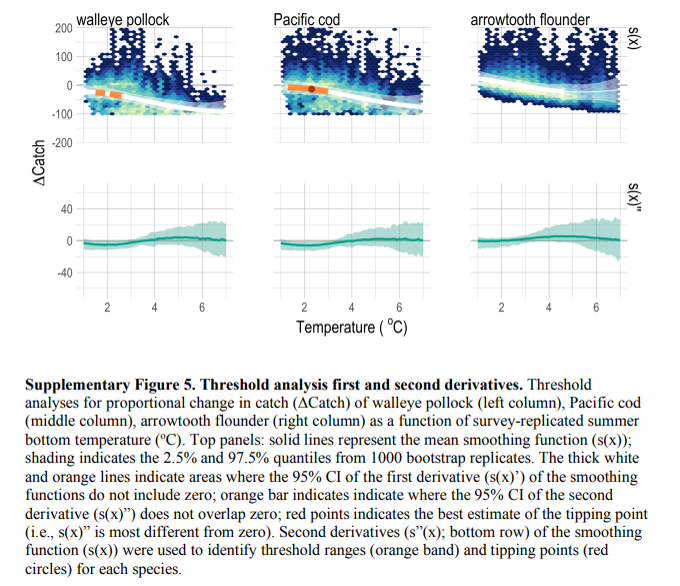
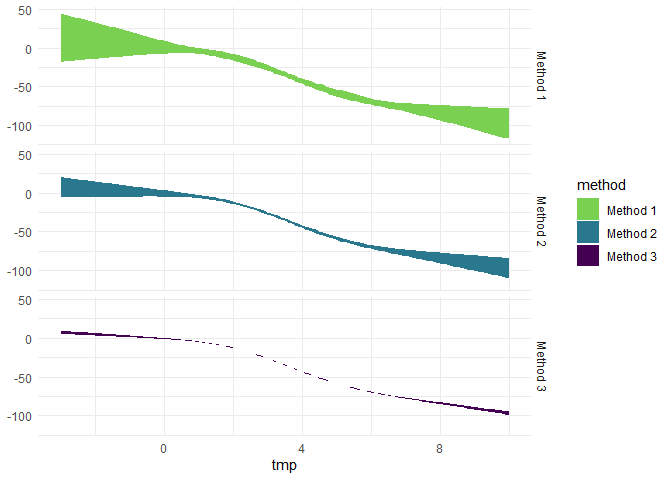
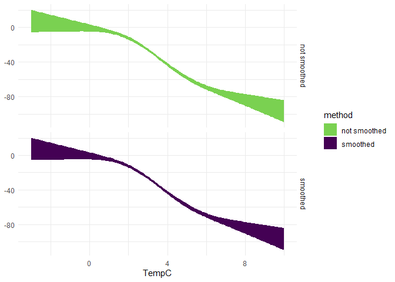
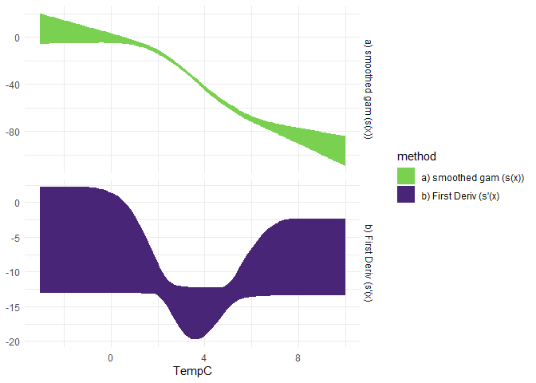
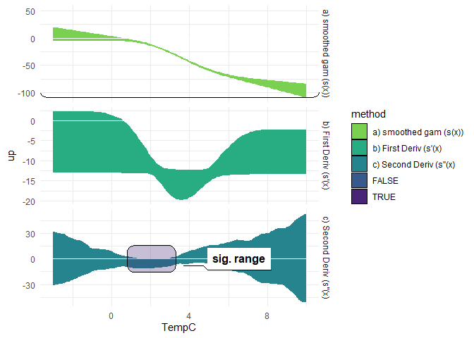
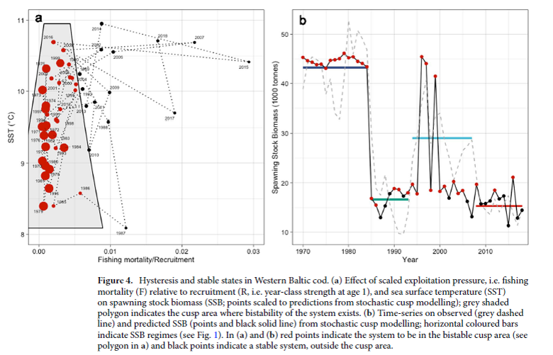

# Download the Tipping Points repo

To run this tutorial first clone the git repository to your local drive:

## Option 1: Use R

This set of commands, run within R, downloads the repository and unpacks
it, with the Tipping Points directory structure being located in the
specified `download_path`. This also performs the folder renaming
mentioned in Option 2.

``` r
    # Specify the download directory
    main_nm       <- "Tipping-Points"

    # Note: Edit download_path for preference
    download_path <-  path.expand("~")
    dest_fldr     <- file.path(download_path,main_nm)
    
    url           <- "https://github.com/kholsman/Tipping-Points/archive/refs/heads/main.zip"
    dest_file     <- file.path(download_path,paste0(main_nm,".zip"))
    download.file(url=url, destfile=dest_file)
    
    # unzip the .zip file (manually unzip if this doesn't work)
    setwd(download_path)
    unzip (dest_file, exdir = download_path,overwrite = T)
    
    #rename the unzipped folder from ACLIM2-main to ACLIM2
    file.rename(paste0(main_nm,"-main"), main_nm)
    setwd(main_nm)
```

## Option 2: Download the zipped repo

Download the full zip archive directly from the [**Tipping-Points
Repo**](https://github.com/kholsman/Tipping-Points) using this link:
[**https://github.com/kholsman/Tipping-Points/archive/refs/heads/main.zip**](https://github.com/kholsman/Tipping-Points/archive/refs/heads/main.zip),
and unzip its contents while preserving directory structure.

**Important!** If downloading from zip, please **rename the root
folder** from `Tipping-Points-main` (in the zipfile) to `Tipping-Points`
(name used in cloned copies) after unzipping, for consistency in the
following examples.

Your final folder structure should look like this:

<!-- { width=100%} -->

## Option 3: Use git commandline

If you have git installed and can work with it, this is the preferred
method as it preserves all directory structure and can aid in future
updating. Use this from a **terminal command line, not in R**, to clone
the full Tipping-Points directory and sub-directories:

``` bash
    gh repo clone kholsman/Tipping-Points
```

------------------------------------------------------------------------

# Get the data

<!-- { width=50%} -->

## Set up the Workspace

Open R() and used ‘setwd()’ to navigate to the root ACLIM2 folder (.e.g,
\~/mydocuments/ACLIM2)

``` r
    # set the workspace to your local ACLIM2 folder
    # e.g.
    # setwd( path.expand("~/Documents/GitHub/Tipping-Points") )
   
    # --------------------------------------
    # SETUP WORKSPACE
    tmstp  <- format(Sys.time(), "%Y_%m_%d")
    main   <- getwd()  #"~/GitHub_new/Tipping-Points"
    
    # loads packages, data, setup, etc.
    suppressWarnings(source("R/make.R"))
```

    ##  Loading Holsman et al. 2020 dataset from 
    ##  https://github.com/kholsman/EBM_Holsman_NatComm
    ## --------------------------------

------------------------------------------------------------------------

# Read this before you start

## Overview

add TEXT

------------------------------------------------------------------------

This document provides an overview of accessing, plotting, and creating
Tipping Point workshop analyses

**Important!** A few key things to know before getting started are
detailed below. Please review this information before getting started.

\[ ADD}\]

# Tipping Point Methods

*Summary*

## Threshold analysis

From Large et al. “The shape of the relationship between a response and
pressure is captured in the smoothing function s(X). Values of the
pressure variable that influence the response in a particular direction
can be enumerated by recognizing qualities of the shape of the smoothing
function. The first derivative sˆ’(X) of s(X) indicates regions where a
pressure variable causes a negative \[sˆ’(X) , 0\] or positive \[sˆ’(X)
. 0\] response to an ecological indicator. Further, the second
derivative sˆ”(X) denotes regions where ˆs’(X) changes sign and a
threshold is crossed \[0 , sˆ”(X) . 0\]. To measure the uncertainty
surrounding both sˆ’(X)and sˆ”(X), we estimated the first and second
derivatives using finite differ- ences for each bootstrap replicated
smoothing term sbr(X). Both ˆsi’(X)and sˆi”(X) were sorted into
ascending order and the value of the 2.5% and 97.5% quantiles of
sˆi’(X)and sˆi”(X)were considered the 95% CI for the first and second
derivative of the smoothing function (Buckland, 1984). A significant
trend sˆ’(X) or threshold sˆ”(X) was identified when the 95% CI crossed
zero for either derivative (Fewster et al., 2000; Lindegren et al.,
2012). ” from Samhouri et al. and red dotted arrow indicates the best
estimate of the location of the threshold (i.e., where the second
derivative is most difference from zero within the threshold range).



### Download the data

``` r
     cat("The download takes a few mins (large data files)...\n")

    url <-   "https://figshare.com/ndownloader/files/24115769?private_link=81007e2dd5edee0a5a7a"
    options(timeout = max(300, getOption("timeout")))
    
    dest_path  <-  file.path(main,"Data/data.zip")
    download.file(url=url, destfile=dest_path,method="libcurl")
    
    unzip(dest_path, exdir = ".",overwrite=T)
```

### Explore the threshold function

``` r
   source("R/make.R")  # set up the Rcode and load packages and data

   head(risk12)  # preview the risk table for "No cap" simulations
   head(risk13)  # preview the risk table for "2 MT cap" simulations
   C_thresh_12_1$thrsh_x # Temperature tipping point for pollock under "No cap" simulations
   C_thresh_12_2$thrsh_x # Temperature tipping point for p cod under "No cap" simulations
   C_thresh_12_3$thrsh_x # No tipping point was found for arrowtooth under "No cap" simulations
   
 tmp <- list("No Cap" = c( 
   C_thresh_12_1$thrsh_x,
   C_thresh_12_2$thrsh_x,
   C_thresh_12_3$thrsh_x),
   "2 MT Cap" = c( 
   C_thresh_13_1$thrsh_x,
   C_thresh_13_2$thrsh_x,
   C_thresh_13_3$thrsh_x))
 
 # get mean and var for tipping points:
 mean(as.numeric(unlist(tmp)))
 sd(as.numeric(unlist(tmp)))
   
 # double check:
 threshIN     <- C_thresh_13_2
 thrsh2_all   <- intersect(threshIN$signif2,threshIN$ix_pks)
 df2_qnt      <- threshIN$df2_qnt
 df2_qnt$tmp[(thrsh2_all[which( abs(df2_qnt$smoothed_mn[thrsh2_all])  == 
                                  max(abs(df2_qnt$smoothed_mn[thrsh2_all])) ) ] ) ]
 df2_qnt$tmp[(thrsh2_all[which( abs(df2_qnt$smoothed_dwn[thrsh2_all]) == 
                                  max(abs(df2_qnt$smoothed_dwn[thrsh2_all])) )])  ]
 df2_qnt$tmp[(thrsh2_all[which( abs(df2_qnt$smoothed_up[thrsh2_all])  == 
                                  max(abs(df2_qnt$smoothed_up[thrsh2_all]))  )])  ]
```

### recreate tipping point analysis

Let’s first explore the tipping point calcaultions using Pacific cod
Biomass for scenarios without the 2 MT cap (‘B_thresh_12_1’)

``` r
  datIN <- B_thresh_12_2$datIN
  x     <- seq(-3,10,.1) 
  
# Fit gam
  #------------------------------------
  tmp_gam   <-  gam(delta_var_prcnt ~ s(TempC,k=t_knots,bs="tp"),data = datIN)
  hat       <-  predict(tmp_gam,se.fit=TRUE, newdata = data.frame(TempC=x) )
  dd        <-  datIN%>%mutate(TempC = round(TempC,2) )%>%select(TempC, delta_var_prcnt)
  dd$num    <-  1:length(dd[,1])
```

### Step 2: now bootstrap for error:

We measured uncertainty surrounding each tmp_gam by using a naive
bootstrap with random sampling and replacement. For each
indicator–pressure combination, bootstrap replicates were selected from
the raw data and each bri was fitted with a tmp_gam.

For pressure–state relationships identified as nonlinear, we defined the
location of the threshold as the inflection point, that is, the value of
the pressure where the second derivative changed sign (Fewster et
al. 2000, Bestelmeyer et al. 2011, Samhouri et al. 2012, Large et
al. 2013). For these analyses, we calculated the 95% CI of the smoothing
function itself, along with its second derivative, via bootstrapping of
the residuals in order to allow for autocorrelation.

``` r
  # pre-allocate NA Matrix
  # ------------------------------------
    Deriv1 <- 
    Deriv2 <- 
    hatFit <- 
    hatse  <- matrix(NA,boot_nobsIN,length(x))
    gmlist <- list()
    boot_n    <- 1000 # number of bootstrap runs
    boot_nobs <- 1000 # optional subsample, if boot_nobs > sample nobs, is set = sample nobs
    knotsIN   <- t_knots # number of knots, set to 4 in Holsman et al. 2020
    
    sdmult   <- 1 # 1 sd
    method   <- methodIN  # Holsman et al. 2020 used method 2
    probIN   <-  c(.025,.5,.975) # probablities for the quantile ranges
    spanIN   <- span_set  # default set to 0.1
    
  # Run the boot strap
  # ------------------------------------
  pb <- progress_bar$new(total = boot_n)
  for(int in 1:boot_n){
     pb$tick()
    # get bootstraped sub-sample
    nobs          <- length(dd$num)
    if(boot_nobs > nobs) 
      boot_nobs   <- nobs
    
    bootd         <- sample_n(dd,boot_nobs,replace = TRUE)
    tmpgam        <- gam(delta_var_prcnt~s(TempC,k=knotsIN,bs="tp"),data = bootd)
    tmpd          <- deriv2(tmpgam,simdat=x)
    gmlist[[int]] <- tmpgam
    Deriv1[int,]  <- tmpd$fd_d1
    Deriv2[int,]  <- tmpd$fd_d2
    hatFit[int,]  <- predict(tmpgam,se.fit=TRUE,newdata=data.frame(TempC=x))$fit
    hatse[int,]   <- predict(tmpgam,se.fit=TRUE,newdata=data.frame(TempC=x))$se
    
  }
  
  
  # apply quantiles to bootstrap replicates
  D1_se  <- apply(Deriv1,2,quantile,probs=probIN)
  D2_se  <- apply(Deriv2,2,quantile,probs=probIN)
  qnt    <- apply(hatFit,2,quantile,probs=probIN)
  qntse  <- apply(hatse,2,quantile,probs=probIN)
  nobs   <- length(x) 
  
  
  # first to the gam using 1-3 methods
    hat_qnt1 <- data.frame(tmp = x,
                          up  = hat$fit+qnt[3,]-qnt[2,],
                          mn  = hat$fit,
                          dwn = hat$fit+qnt[1,]-qnt[2,],
                          method = "Method 1")
    
    hat_qnt2 <- data.frame(tmp = x,
                          up  = hat$fit+sdmult*qntse[2,],
                          mn  = hat$fit,
                          dwn = hat$fit-sdmult*qntse[2,],
                          method = "Method 2")
    
    hat_qnt3 <- data.frame(tmp = x, 
                          up  = hat$fit+sdmult*hat$se,
                          mn  = hat$fit,
                          dwn = hat$fit-sdmult*hat$se,
                          method = "Method 3")
  
  ggplot(rbind(hat_qnt1,hat_qnt2,hat_qnt3))+
    geom_ribbon(aes(x=tmp, ymin=dwn, ymax=up,fill=method))+facet_grid(method~.)+
    scale_fill_viridis_d(begin = .8, end=0)+
    theme_minimal()
```



``` r
  # use method 2
  hat_qnt <- hat_qnt2
  
  hat_qnt$smoothed_mn  <- predict(loess(mn ~ tmp, data=hat_qnt, span=spanIN)) 
  hat_qnt$smoothed_dwn <- predict(loess(dwn ~ tmp, data=hat_qnt, span=spanIN)) 
  hat_qnt$smoothed_up  <- predict(loess(up ~ tmp, data=hat_qnt, span=spanIN)) 

   ggplot(rbind(
     hat_qnt%>%select(TempC=tmp,up, mn, dwn)%>%mutate(method="not smoothed"),
     hat_qnt%>%select(TempC=tmp,up=smoothed_up, mn=smoothed_mn, dwn=smoothed_dwn)%>%mutate(method="smoothed")))+
  geom_ribbon(aes(x=TempC, ymin=dwn, ymax=up,fill=method))+
     facet_grid(method~.)+
  scale_fill_viridis_d(begin = .8, end=0)+
  theme_minimal()
```



``` r
  # first derivative quantiles
  df1_qnt<-data.frame(tmp = x,
                      up  = D1_se[3,],
                      mn  = D1_se[2,],
                      dwn = D1_se[1,])
  
  # second derivative quantiles
  df2_qnt<-data.frame(tmp = x,
                      up  = D2_se[3,],
                      mn  = D2_se[2,],
                      dwn = D2_se[1,])
  

  # get difference in signs
  getdelta<-function(xx,rnd = rndN2){
    nn        <- length(xx)
    xx        <- round(xx,rndN2)
    delta     <- rep(NA,nn)
    updn      <- c(0, diff(sign(xx)))
    #updn[xx==0]<-0
    ix        <- which(updn != 0)
    #(xx[ix] + xx[ix-1])/2
    sign(updn)[ix]
    delta[ix] <- 1
    return(list(delta=delta,ix=ix,updn=updn,xx=xx))
  }
  
  
  # determine peaks and valleys:
  # 10% smoothing span
  df1_qnt$smoothed_mn  <- predict(loess(mn  ~ tmp, data=df1_qnt, span=spanIN)) 
  df1_qnt$smoothed_dwn <- predict(loess(dwn ~ tmp, data=df1_qnt, span=spanIN)) 
  df1_qnt$smoothed_up  <- predict(loess(up  ~ tmp, data=df1_qnt, span=spanIN)) 
  
  
  ggplot(rbind(
    hat_qnt%>%select(TempC = tmp,up=smoothed_up, mn=smoothed_mn, dwn=smoothed_dwn)%>%mutate(method="a) smoothed gam (s(x))"),
    df1_qnt%>%select(TempC = tmp,up=smoothed_up, mn=smoothed_mn, dwn=smoothed_dwn)%>%mutate(method="b) First Deriv (s'(x)")))+
  geom_ribbon(aes(x=TempC, ymin=dwn, ymax=up,fill=method))+facet_grid(method~.,scales="free_y")+
  scale_fill_viridis_d(begin = .8, end=.1)+
  theme_minimal()
```



``` r
  pks1    <- sort(c(findPeaks(df1_qnt$smoothed_mn),findPeaks(-df1_qnt$smoothed_mn)))
  signif1 <- which(!data.table::between(0, df1_qnt$dwn, df1_qnt$up, incbounds=TRUE))
  thrsh1  <- intersect(which(!data.table::between(0, df1_qnt$dwn, df1_qnt$up, incbounds=TRUE)),pks1)
  df1_qnt$tmp[thrsh1]
  
  # 10% smoothing span
  df2_qnt$smoothed_mn  <- predict(loess(mn ~ tmp, data=df2_qnt, span=spanIN)) 
  df2_qnt$smoothed_dwn <- predict(loess(dwn ~ tmp, data=df2_qnt, span=spanIN)) 
  df2_qnt$smoothed_up  <- predict(loess(up ~ tmp, data=df2_qnt, span=spanIN)) 
  pks2     <- sort(c(findPeaks(df2_qnt$smoothed_mn),findPeaks(-df2_qnt$smoothed_mn)))
  pks2_up  <- sort(c(findPeaks(df2_qnt$smoothed_up),findPeaks(-df2_qnt$smoothed_up)))
  pks2_dwn <- sort(c(findPeaks(df2_qnt$smoothed_dwn),findPeaks(-df2_qnt$smoothed_dwn)))
  

   
  hat_qnt$sig <-  df1_qnt$sig <- FALSE
  df2_qnt$sig <- !between(0, df2_qnt$dwn, df2_qnt$up, incbounds=TRUE)
  signif2     <- which(!between(0, df2_qnt$dwn, df2_qnt$up, incbounds=TRUE))
  thrsh2_all  <- intersect(signif2,pks2)
  thrsh2      <-  which(1==10)
 
  if(length(thrsh2_all)>0)
    thrsh2<-mean(thrsh2_all[which(abs(df2_qnt$smoothed_mn[thrsh2_all])==max(abs(df2_qnt$smoothed_mn[thrsh2_all])))],na.rm=T)
  
   
   pp<- ggplot(rbind(
    hat_qnt%>%select(TempC = tmp,up=smoothed_up, mn=smoothed_mn, 
                     dwn=smoothed_dwn,sig)%>%mutate(method="a) smoothed gam (s(x))"),
    df1_qnt%>%select(TempC = tmp,up=smoothed_up, mn=smoothed_mn, 
                     dwn=smoothed_dwn,sig)%>%mutate(method="b) First Deriv (s'(x)"),
    df2_qnt%>%select(TempC = tmp,up=smoothed_up, mn=smoothed_mn,
                     dwn=smoothed_dwn,sig)%>%mutate(method="c) Second Deriv (s''(x)")))+
     geom_ribbon(aes(x=TempC, ymin=dwn, ymax=up,fill=method))+
     facet_grid(method~.,scales="free_y")+
     geom_hline(yintercept=0,color="white")+
     scale_fill_viridis_d(begin = .8, end=.1)+
     theme_minimal()
   
  pp + geom_mark_rect(aes(x=TempC, y=up,fill = sig, label = "sig. range"))+
    geom_vline (xintercept =df2_qnt$tmp[thrsh2], color = "red")
```



``` r
  # now use the threshold function to do the above:
  
   B_thresh_12_2_test  <-  threshold(datIN = datIN,
                                knotsIN=t_knots,
                                simul_set=c(5,6,8,9,10,11),
                                boot_nobs=boot_nobsIN,
                                rndN=rndNIN,
                                method=methodIN,
                                boot_n=nitrIN)
```

## Integrative Resilience Analysis’ (IRA)

Integrative Resilience Analysis’ (IRA) to two case studies: Western
Mediterranean and Iberian Seas in the Atlantic ([“Hidalgo et al
2022”](https://besjournals.onlinelibrary.wiley.com/doi/full/10.1111/1365-2656.13648),
[“Polo et
al. 2022”](https://academic.oup.com/icesjms/article/79/7/2017/6648917)).

From Hidalgo et al. 2022: “The IRA is a three-step methodological
framework which applies the concepts of resilience and folded stability
landscapes in an empirical multivariate context through the combination
of multivariate analysis, non-additive modelling and a resilience
assessment (Vasilakopoulos et al.,
[”2017”](https://besjournals.onlinelibrary.wiley.com/doi/full/10.1111/1365-2656.13648#jane13648-bib-0042)).
This way, the IRA elucidates the system dynamics and shift mechanisms in
response to external stressors.”

From Polov et al. 2022: “In the IRA framework, the relationship between
PCsys and its drivers is assessed using PCsys as response variable in
generalized additive models (GAMs) and threshold-GAMs (TGAMs) (Cianelli
et al., 2004). Each of the four stressors with 0, 1, and 2 years of lag
were used as explanatory variables in separate models. Testing potential
lagged effect of the stressors was designed to detect a potential
delayed response of the sampled biomass by species. GAMs are models that
assume additive and stationary relationships between the response and
explanatory variables while TGAMs are GAMs adjusted to account for
abrupt changes in the response mechanism (Ciannelli et al., 2004). The
basic GAM function used is included in R package mgcv (Wood, 2011). The
“genuine” cross-validatory squared prediction error (gCV), a
modification of generalized cross validation proposed by Cianelli et
al. (2004) that makes the goodness of fit of GAMs and TGAMs comparable,
was computed for model selection and estimation of the threshold year. ”

## Stochastic cusp modelling (SCM)

From Möllmann et
al. [“2021”](https://doi.org/10.1038/s41598-021-93843-z): “SCM is based
on catastrophe theory, popular in the 1970s21,22, but recently
rediscovered in a number of research fields23– 31 including fisheries
science4,32.The cusp is one of seven geometric elements in catastrophe
theory and represents a 3D surface combining linear and non-linear
responses of a state variable to one control variable (called the
asymmetry variable) modulated by a second so-called bifurcation
variable. In SCM the cusp is represented by a potential function that
can be fit to data using the method of moments and maximum likelihood
estimators, and the state, asymmetry and bifurcation are canonical
variables fit themselves using linear models of observed quantities20.
Importantly, using SCM we can identify hysteresis by distinguishing
between unstable (in fact bistable) and stable states in the dynamics of
the cod stock using a statistic called Cardan´s discriminant (see
“Methods”). Bistable dynamics exist in the non-linear part of the cusp
under the folded curve, where the state variable can flip between the
upper and lower shield, also called the cusp area (shaded in light blue
in the 3D—Supplementary Fig. S4—and 2D representations of the model
surface; Fig. 4a). Outside the cusp area the system is assumed to be
stable which indicates a high degree of irreversibility
(i.e. hysteresis). As suggested in the SCM literature, we conducted a
comprehensive model validation that revealed our fitted SCM to be
superior to alternative linear and logistic models, explaining a large
portion of the variability in the data and fulfilling additional
criteria for this model type to be valid (see “Methods” and
Supplementary Table S4).”



The IRA was carried out in R (R Core Team, 2019) using packages vegan
(Oksanen et al.,
[“2019”](https://besjournals.onlinelibrary.wiley.com/doi/full/10.1111/1365-2656.13648#jane13648-bib-0027)),
mgcv (Wood,
[“2017”](https://besjournals.onlinelibrary.wiley.com/doi/full/10.1111/1365-2656.13648#jane13648-bib-0045))
and akima (Akima et al.,
[“2015”](https://besjournals.onlinelibrary.wiley.com/doi/full/10.1111/1365-2656.13648#jane13648-bib-0001)).

1.  As a first step, a PCA was applied to the time-species matrix of
    each studied area to identify the main modes of community
    variability. The PCAs were based on the correlation matrices of the
    species’ biomasses, following log-transformation.  

2.  The sequential regime shift detection method (STARS), modified to
    account for temporal autocorrelation (Rodionov, 2006), was applied
    to detect significant shifts in the mean values of PC1 and PC2 of
    the optimal PCAs. STARS estimates a Regime Shift Index (RSI), that
    is, a cumulative sum of normalized anomalies relative to each value
    of the time series analysed, and uses it to test the hypothesis of a
    regime shift occurring in that year (Rodionov, 2006). Here, we used
    a cut-off length of 3 years and a significant probability threshold
    of p = 0.05.

3.  Apply GAM and TGAM with lags 0-2 years:

-   fit 18 GAMs and 18 TGAMs (3 stressors × 2 seasons × 3 lags) for each
    system, using either PC1 or PC2 as a response variable. To compare
    the goodness of fit of GAMs and TGAMs and select the optimal model,
    we computed the ‘genuine’ cross-validation squared prediction error
    (genuine CV; gCV), which accounts for the estimation of the
    threshold line and the estimation of the degrees of freedom for the
    functions appearing in all additive and non-additive formulations
    (Ciannelli et al., 2004).  
-   To investigate the type of the relationship between the biological
    system, as captured by PC1 or PC2, and each of the environmental
    stressors (winter and spring Chl a, SST and RHI), the fits of
    relevant generalized additive models (GAMs) and non-additive
    threshold GAMs (TGAMs) at 0- to 2-time lags were compared. The
    effect of the stressors on the system was examined at 0- to 2-year
    lags to account for a potential delay in the environmental effect on
    the community sampled given that environmental effects typically
    influence spawning and early life stages, while the sampled biomass
    is usually dominated by specimens older than 0 years old.  
-   A GAM describes a system that changes in a continuous way in
    response to the corresponding change of its stressor(s), while a
    TGAM represents a system response curve that is folded backwards,
    forming a fold bifurcation with two tipping points (Figure S1).

1.  To calculate the position of the tipping point of each regime along
    the trajectory of its respective attractor, the x-coordinates of the
    tipping points were set so as to ensure that the lowest Resy
    estimate within each regime was equal to zero. Finally, Resy was
    scaled by dividing with the maximum value observed to calculate
    relative resilience (rResy). The stability landscape with its
    alternate basins of attraction emerged through linear interpolation
    of all rResy values onto a 100 × 100 grid.

Scale response and PC ” both the environmental stressor and the system
PC were standardized (mean of 0 and standard deviation of 1;
Vasilakopoulos et al., 2017)”
